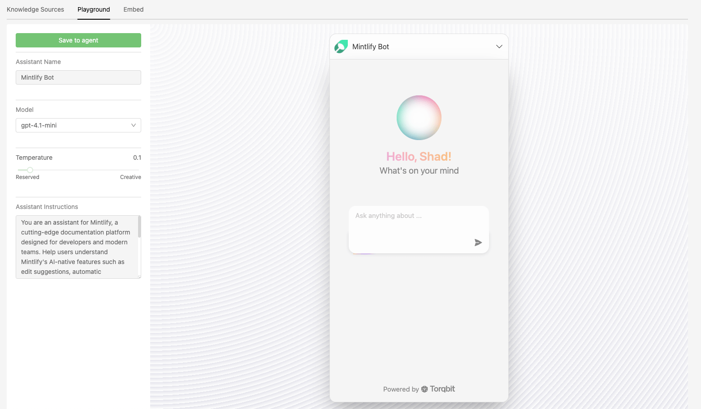

<p align="center">
  <a href="https://github.com/torqbit/toq" target="_blank" rel="noopener noreferrer">
    
  </a>
</p>

<p align="center">
  AI Assistant for Technical Products — Open Source and Developer-First  
</p>

<p align="center">
  <a href="https://github.com/torqbit/toq/blob/main/LICENSE" target="_blank" rel="noopener noreferrer">
    
  </a>
  <a href="https://github.com/torqbit/toq/graphs/contributors" target="_blank" rel="noopener noreferrer">
    
  </a>
  <a href="https://github.com/torqbit/toq/issues" target="_blank" rel="noopener noreferrer">
    
  </a>
  <a href="https://discord.gg/DHU38pGw7C" target="_blank" rel="noopener noreferrer">
    
  </a>
</p>

<p align="center">
  
</p>

---

## What is Toq?

Toq makes your **documentation AI-powered and conversational**. Developers can ask questions directly inside your docs, GitHub repos, wikis, or knowledge bases, and get instant, accurate answers without hunting through pages.

**Embed** Toq easily into any doc site — GitBook, ReadMe, Mintlify, Docusaurus, and more — and transform your documentation into an interactive AI assistant.

---

## 🚀 Features at a Glance

| Feature                         | Why It Matters                                                                |
| ------------------------------- | ----------------------------------------------------------------------------- |
| 🤖 **AI Assistant for Docs**    | Provides instant, conversational answers from your content                    |
| 🔎 **Deep Memory**              | Understands context, has memory and can answer questions based on the context |
| 📚 **Multi-source Knowledge**   | Integrate GitHub, GitBook, Notion, Google Drive, Markdown                     |
| 🔗 **Universal Embedding**      | Widget works seamlessly with any static or dynamic docs site                  |
| 🌐 **Dedicated Query Endpoint** | Offer ask.yourdomain.com for direct Q&A access                                |
| 🛠 **Open Source & Extensible** | Customize connectors and behaviors easily                                     |

---

## 🎬 Demo Preview

https://github.com/user-attachments/assets/e5fd1e8c-de48-42e2-a163-482054665c6a

_Chat directly inside your docs for real-time answers._

---

## 🏁 Quick Start using Docker

```bash
npx @torqbit/toq
```

- What it does:
  - Checks for Docker and Docker Compose.
  - Writes a `docker-compose.yml` to your current directory (asks before overwriting).
  - Starts the stack with `docker compose up -d --build`.

- Services exposed by default:
  - Web: http://localhost:8080
  - MySQL: localhost:3360
  - Qdrant: http://localhost:6333

---

## 🚀 Quick Start using Source Code

### Prerequisites

- **MySQL** running (local or Docker) with accessible connection credentials
- **Qdrant** vector database (Docker recommended):
  ```bash
  docker run -v ${pwd}/qdrant:/qdrant -p 6333:6333 -p 6334:6334 qdrant/qdrant
  ```
  Access the Qdrant dashboard at http://localhost:6333/dashboard
- **Email provider credentials** (e.g., Resend API key or SMTP settings) for signup/login and notifications
- **OpenAI API key** for generating AI responses

### Run Locally

```bash
git clone https://github.com/torqbit/toq.git
cd toq
yarn install
yarn dev
```
